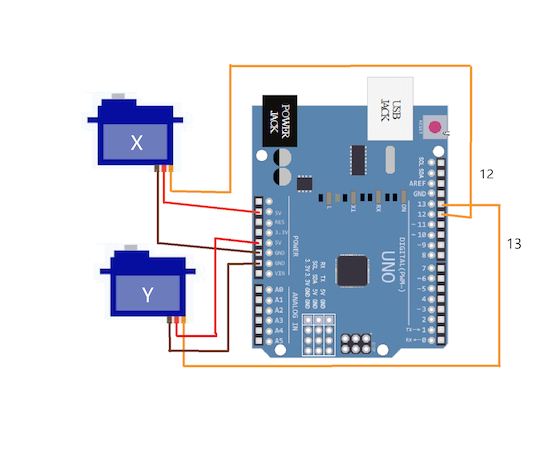

# Desk-Emoji

Desk-Emoji is a truly open-source AI desktop robot featuring an emoji screen, a two-axis console, and LLM capabilities for voice chat. ( [Demo](https://www.bilibili.com/video/BV1GnsdePEaz/) )

## Installation

### Hardware

* Assamble the robot first. There are 2 axis servos:
  
* OLED display connection:
  
* Download Auriodo [IDE](https://www.arduino.cc/en/software/).
* Connect Arduino board to PC and select the right board type.
* Compile and upload `motor_center.ino` to center the motors.
* Compile and upload `oled_test.ino` to test the OLED screen.
* Finally, compile and upload `robot_base.ino` to the board.

### Software

* Python version <= 3.11
* Initialize environment

  * For MacOS or Linux:
    * run `init.sh`
  * For Windows:
    * run `init.bat`
  * Edit `settings.py` to set API keys.
* Test robot

  * Activate virtual environment at first:
    * For MacOS or Linux: `source .venv/bin/activate`
    * For Windows: `.venv\Scripts\activate`
  * Test action: `python action.py`
  * Test chat:  `python chat.py`

## Author

* Mark Yang
* Email: mark.yang@ewen.ltd
