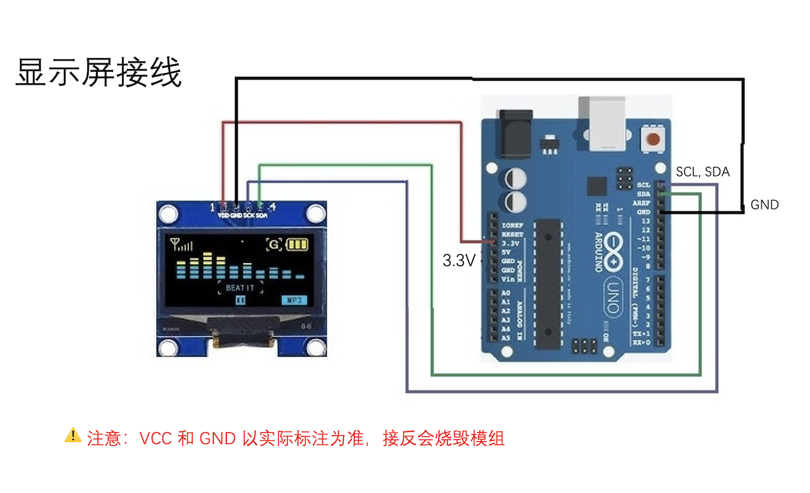
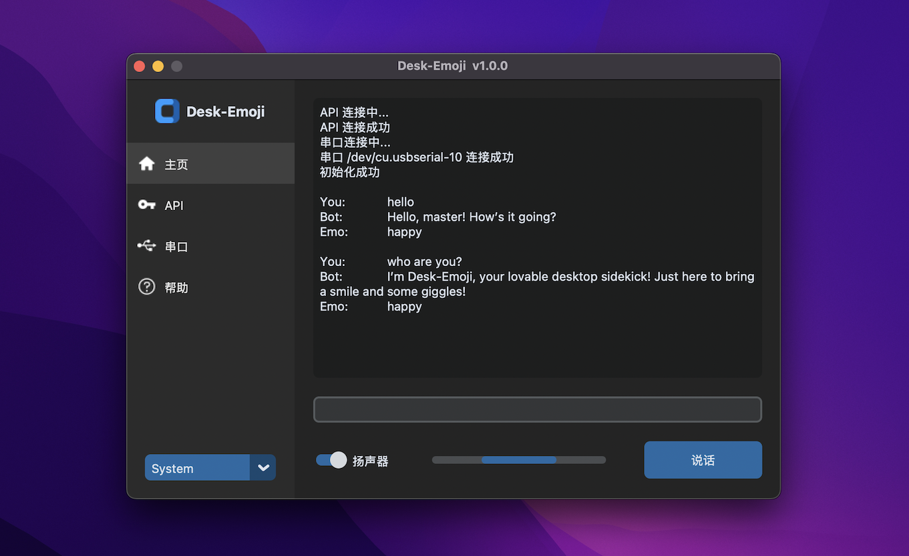

# Desk-Emoji

Desk-Emoji is a truly open-source AI desktop robot featuring an emoji screen, a two-axis console, and LLM capabilities for voice chat. ( [Demo](https://www.bilibili.com/video/BV1GnsdePEaz/) )

## Installation

### Hardware

* Assamble 2 axis servos:
  
* OLED display connection:
  

### Software

* 3.9 <= Python version <= 3.11
* Initialize environment

  * For MacOS or Linux:

    * `./init.sh`
    * `source .venv/bin/activate`
  * For Windows:

    * `.\init.bat`
    * `.venv\Scripts\activate`
* Launch the main program

  * `python main.py`
  * 
* Test code

  * Test action: `python action.py`
  * Test chat:  `python chat.py`

## Author

* Mark Yang
* Email: mark.yang@ewen.ltd
