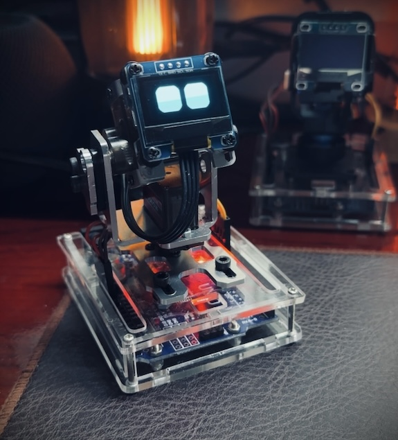

# Desk-Emoji

Desk-Emoji is a truly open-source AI desktop robot featuring an emoji screen, a two-axis console, and LLM capabilities for voice chat.

## Installation

### Hardware

* Assamble the robot first.
* Download Auriodo [IDE](https://www.arduino.cc/en/software/).
* Connect Arduino board to PC and select the right board type.
* Compile and upload `motor_center.ino` to center the motors.
* Compile and upload `oled_test.ino` to test the OLED screen.
* Finally, compile and upload `robot_base.ino` to the board.

### Software

* Initialize environment

  * `python3 -m venv .venv`
  * `source .venv/bin/activate`
  * `pip3 install -r requirements.txt`
  * Edit `settings.py` to set API keys.
* Test robot

  * Test action: `python3 action.py`
  * Test chat:  `python3 chat.py`

## Author

* Mark Yang
* Email: mark.yang@ewen.ltd
