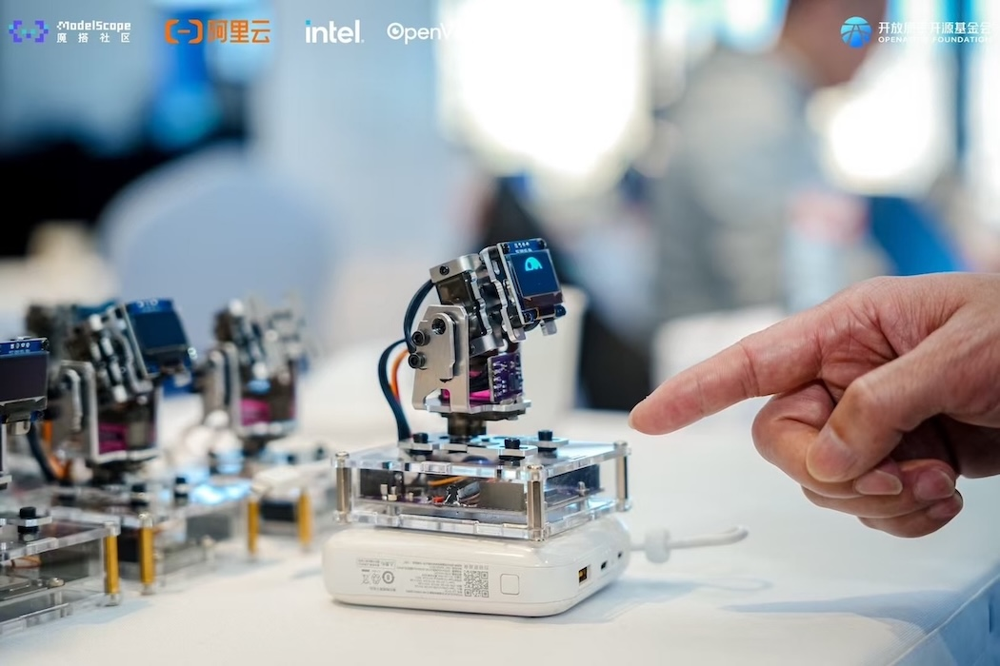
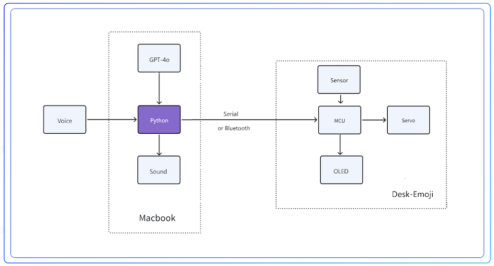

# Desk-Emoji

## 概述

* 首款工业风桌面机器人，外形炫酷，可作桌搭摆件。
* 极致性价比，百元实现千元级桌面机器人效果。
* 具备2自由度云台，丰富的头部运动，是一款真正可动的桌面机器人。
* 精心调校的 Emoji 表情动画和运动算法，流畅而生动，情绪价值拉满。
* 可根据回复内容的情绪做出相应的动作反馈。
* 支持手势识别互动。
* 支持大模型语音对话。

## 系统框图

## 资源

* [散件组装教程](doc/zh/组装教程.md)
* [上位机软件教程](doc/zh/软件手册.md)
* [固件下载](https://gitee.com/ideamark/desk-emoji/releases)
* [B站视频](https://space.bilibili.com/3546754517567616)

## 购买

* [淘宝店](https://m.tb.cn/h.TclZzcV4aOoAzmj)

## 作者

* Mark Yang
* 邮箱: mark.yang@ewen.ltd

## 版权声明

* 本产品已申请专利并获得质量检验认证。
* 开源部分可在遵循 GPLv3 协议的前提下自行 DIY。
* 未经许可进行商业使用将承担法律责任。
