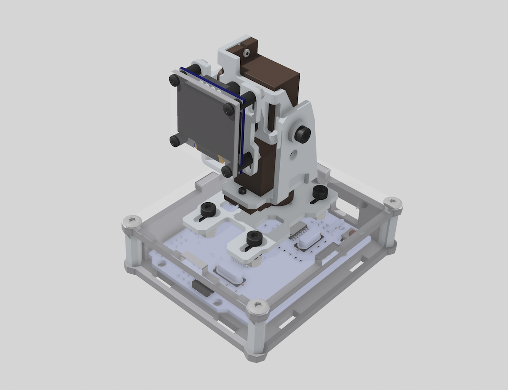

# Desk-Emoji

## 概述

* 首款工业风桌面机器人，外形炫酷，可作桌搭摆件。
* 极致性价比，百元实现千元级桌面机器人效果。
* 具备2自由度云台，丰富的头部运动，是一款真正可动的桌面机器人。
* 精心调校的 Emoji 表情动画和运动算法，流畅而生动，情绪价值拉满。
* 可根据回复内容的情绪做出相应的动作反馈。
* 支持手势识别互动。
* 支持大模型语音对话。

## 资源

* [B站视频](https://space.bilibili.com/3546754517567616)
* [固件下载](https://gitee.com/ideamark/desk-emoji/releases)
* [在线文档](https://gitee.com/ideamark/desk-emoji/tree/main/doc/zh)

## 购买

* [淘宝店](https://m.tb.cn/h.TclZzcV4aOoAzmj)
* [小红书](https://www.xiaohongshu.com/user/profile/6470bd26000000002a034397)

## 作者

* 马克叔叔（Mark Yang）
* 邮箱: mark.yang@ewen.ltd

## 版权声明

* 本项目的开源内容遵循 **GPLv3 协议** ，允许用户在协议框架内自由学习、修改及进行非商业用途的 DIY 实践。 **未经授权** ，禁止将开源内容用于任何商业用途，否则将依法追究法律责任。
