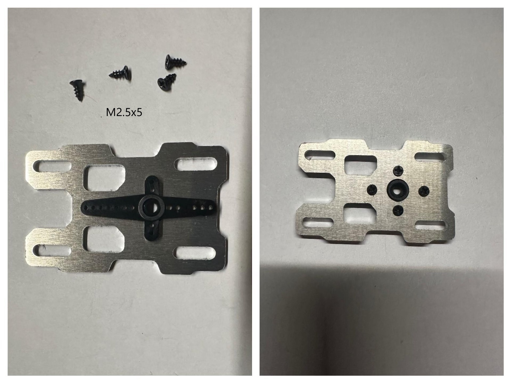
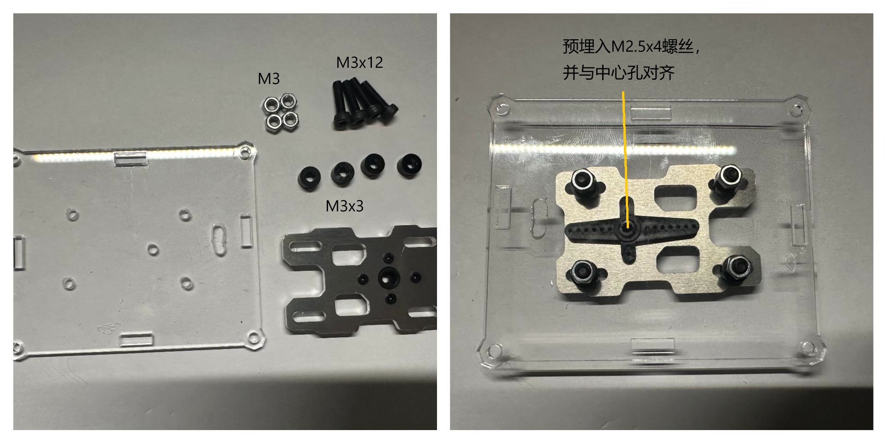
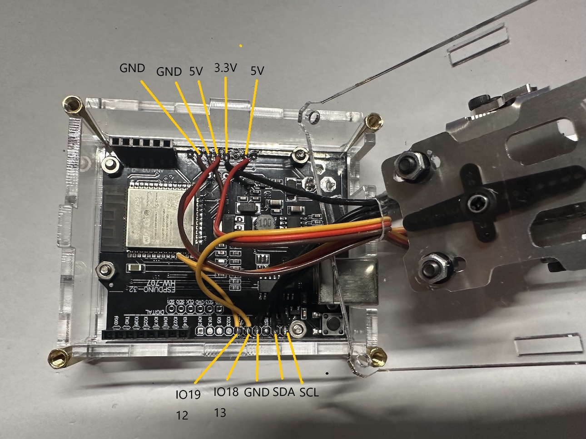
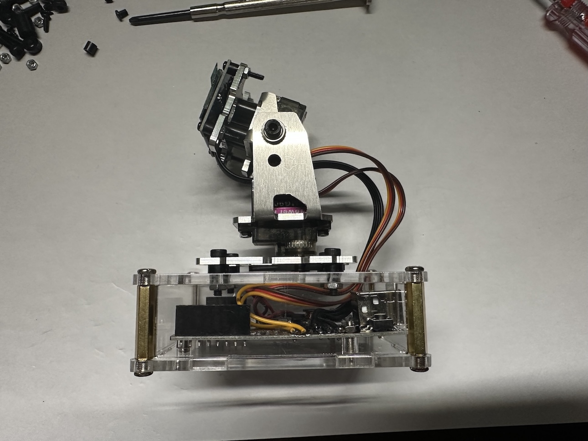
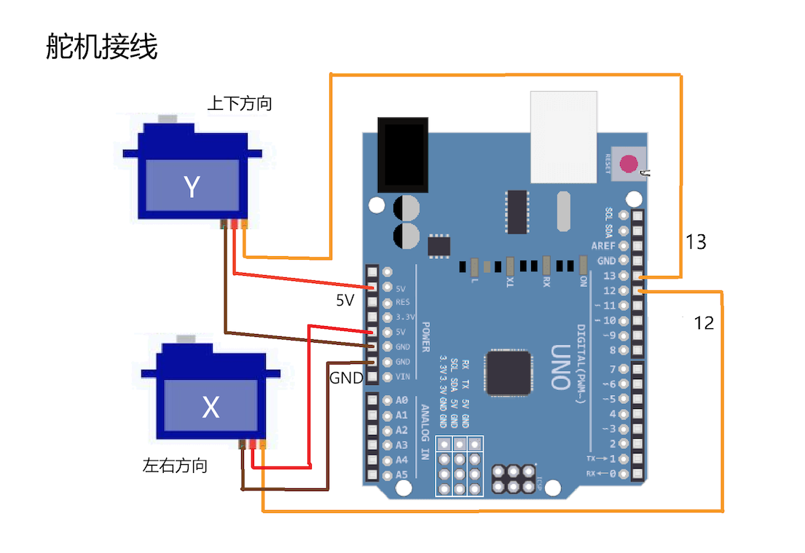

## Console assembly

* y-axis servo.

* x-axis servo

* Console

* Base

* Board

* OLED screen

* Wires connection

* finished

## Hardware connection

* OLED screen connection

* Servos connection

  
