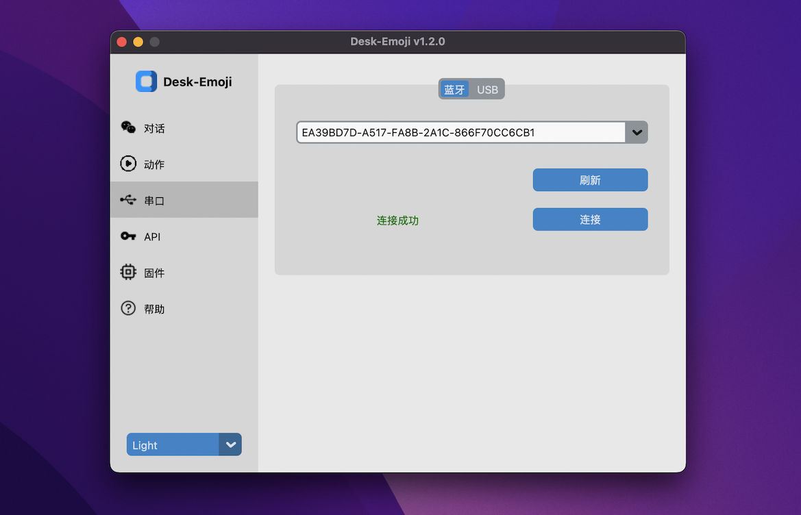
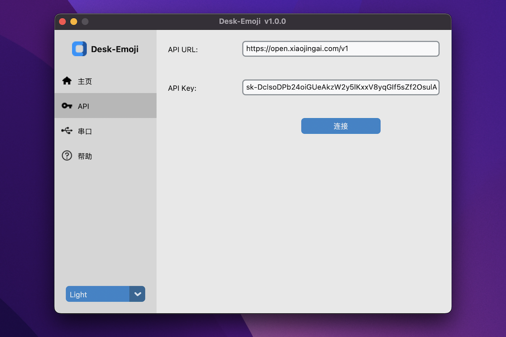
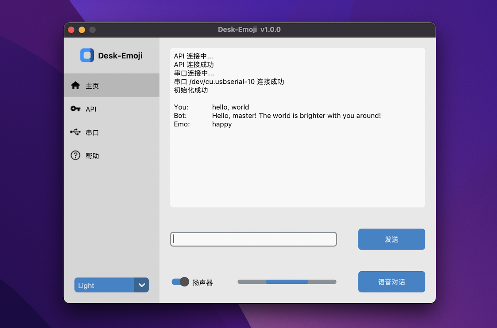
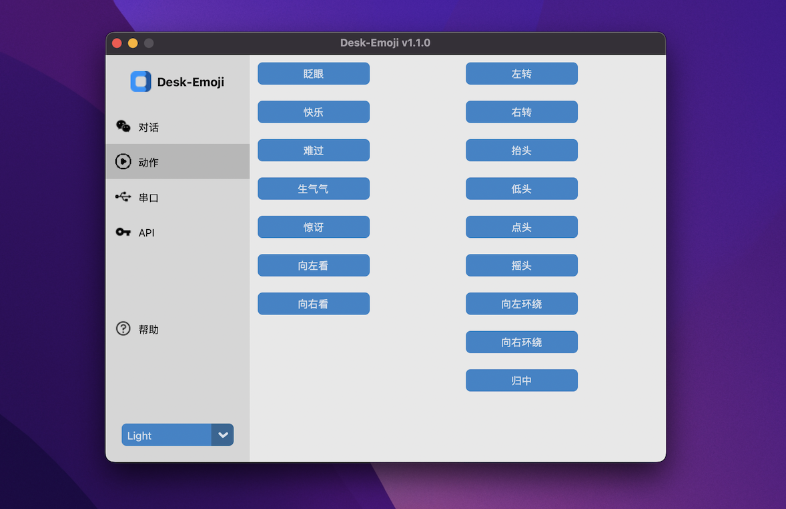

## Installation

* Download and install Python from [python.org](https://www.python.org/). ( Recommend version: >=3.9, <=3.11)
* For MacOS or Linux: `./start.sh`
* For Windows: `.\start.bat`
* Please be patient during the installation of dependencies on the first startup.

## Usage

* Set serial port first: Select Bluetooth or USB -> click the "Scan" button -> select the right device -> click the "Connect" button.
  
* Set API url and key. (should support GPT-4o-mini)
  
* Switch to chat page for chat.
  
* Switch to action page for action test.
  
