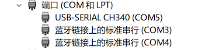
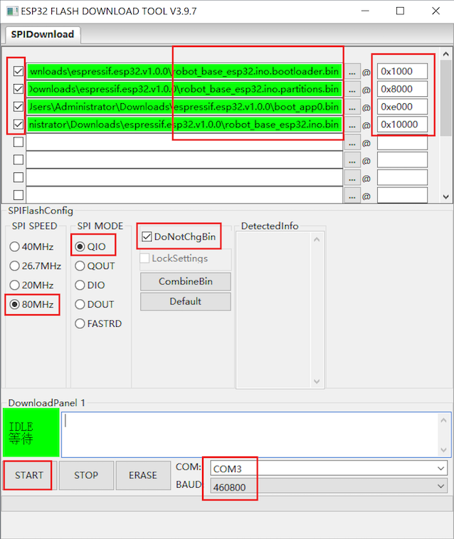

# ESP32固件烧录

注：主板默认已烧录固件，仅在固件升级时需要烧录。

1. 首先从Espressif官网下载 [Flash Download Tools](https://www.espressif.com/../support/download/other-tools)（仅支持Windows）
2. 从 [Github Release](https://github.com/ideamark/desk-emoji/releases) 上下载固件并解压。
3. 将ESP32主板连接电脑，从设备管理器查看端口号（这里是COM5）

4. 启动 flash_download_tool.exe, 选择 ESP32

5. 按照如下配置载入bin文件，点击START完成烧录。

