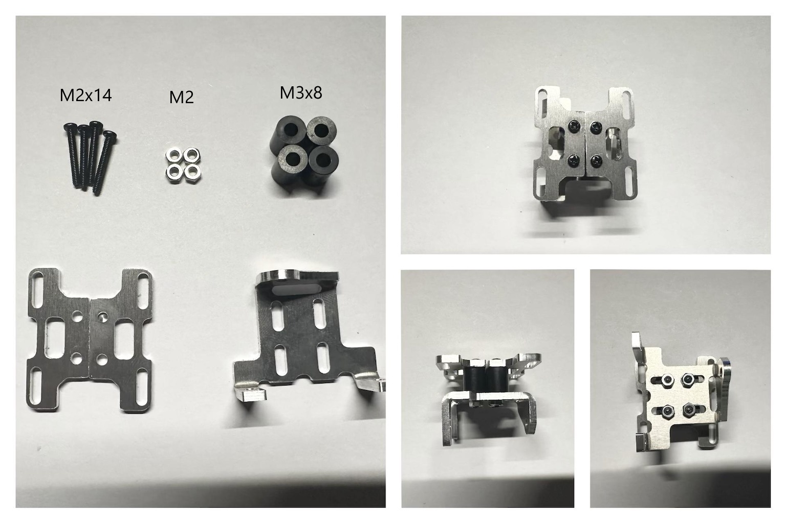
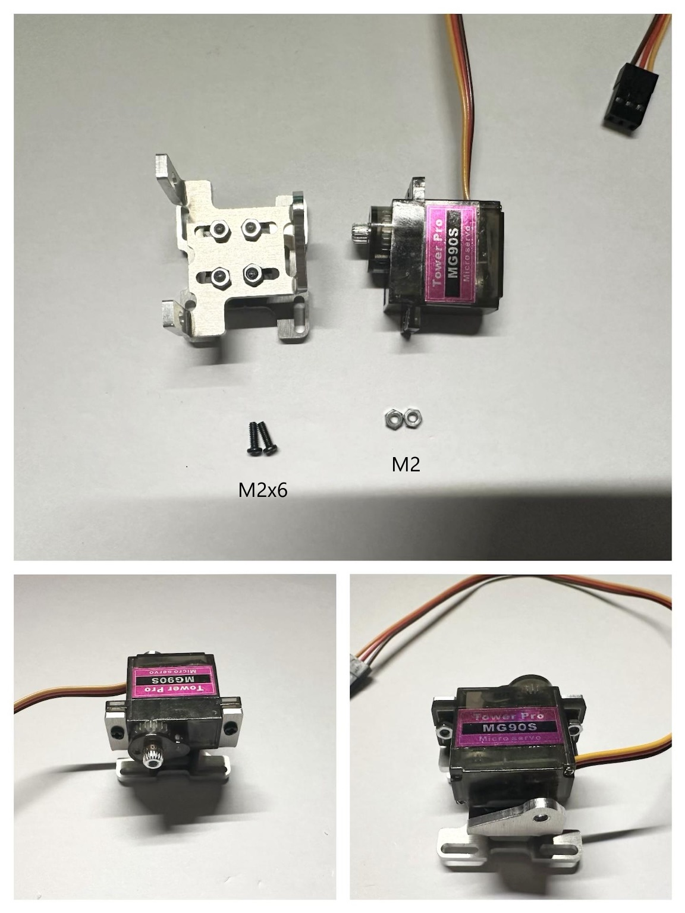
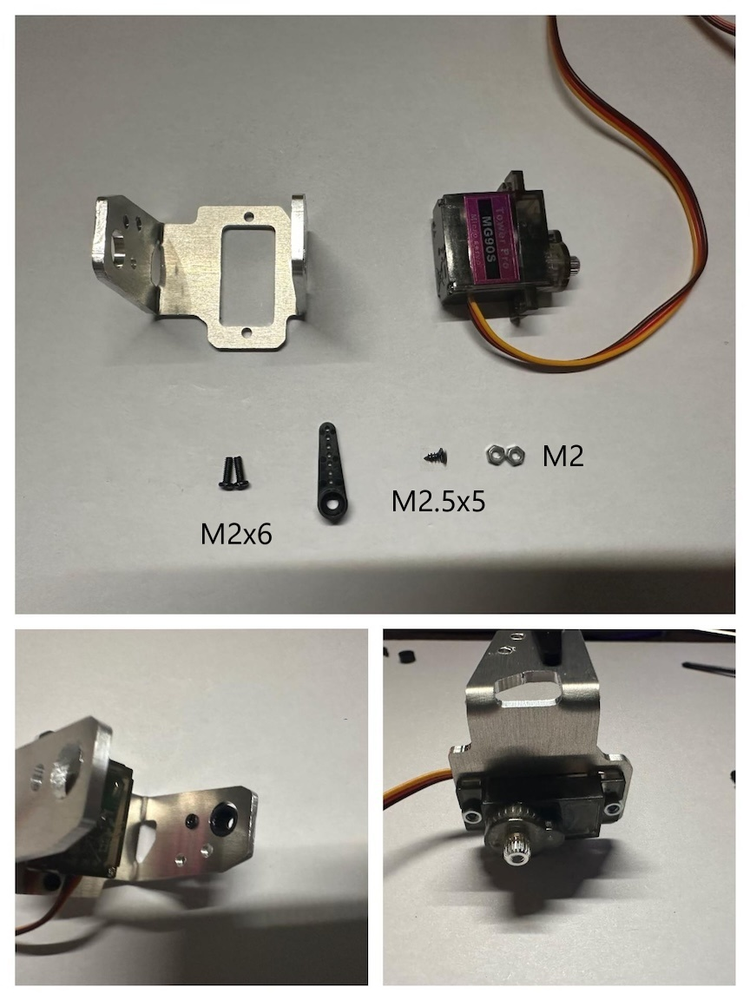
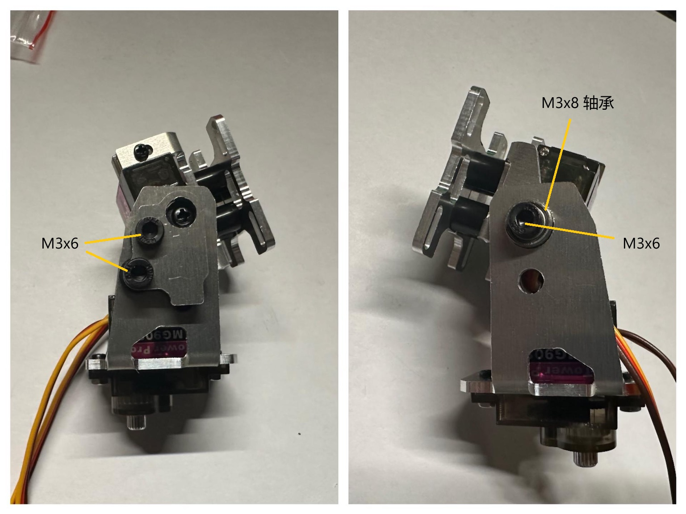
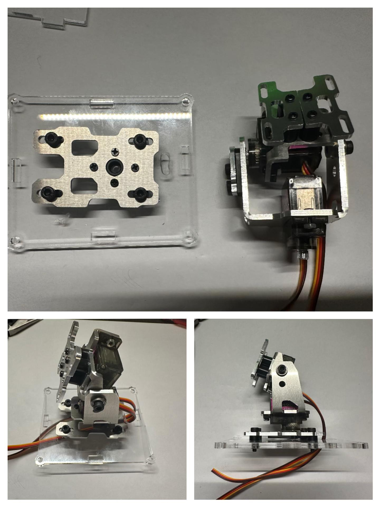
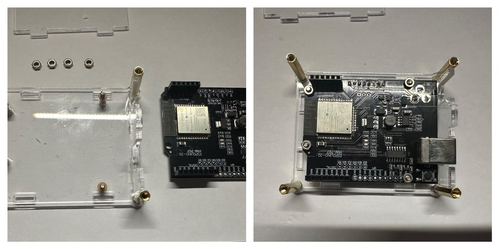
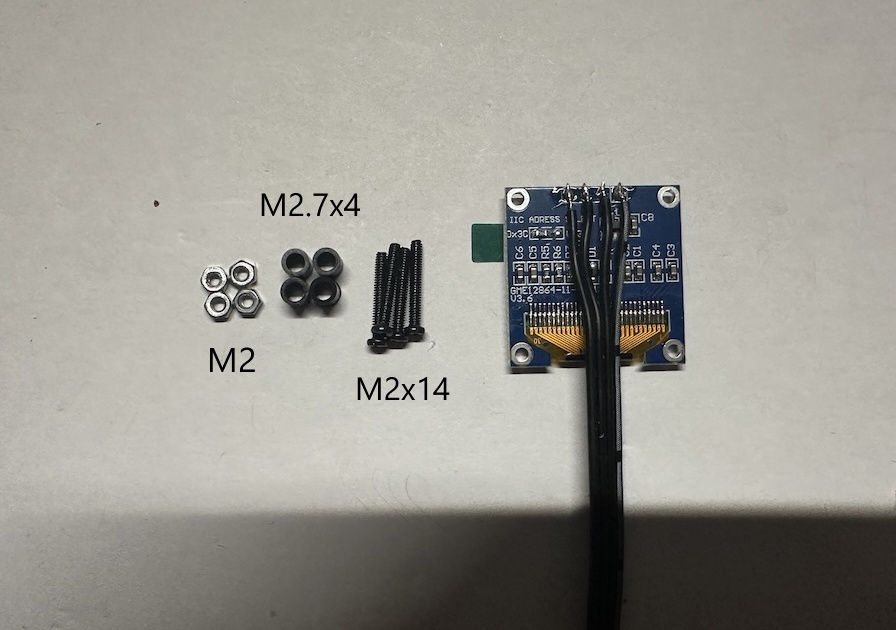
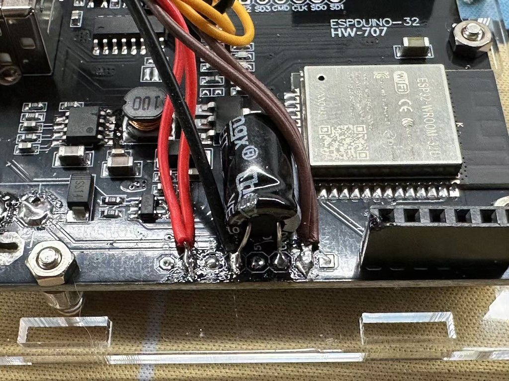
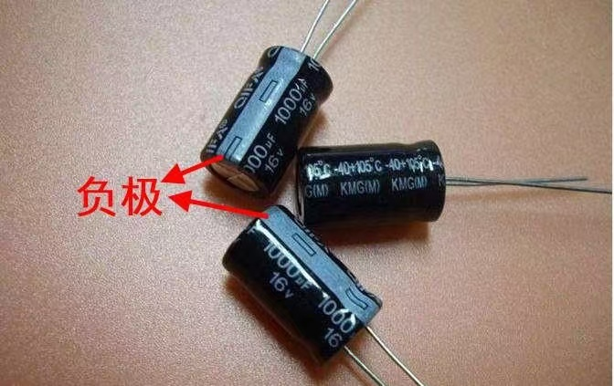

## 云台组装

* Y 轴舵机安装

* X 轴舵机安装

* 云台组装。先卡入Y轴舵机齿轮部分，再缓慢将另一边压入。组装后如下：

* 使用自攻螺丝安装底座

* 安装主板

* 焊接并安装OLED显示屏

* 主板接线

* 成品

## 硬件接线图

* OLED 显示屏接线

* 舵机接线

* 对于 ESP32 和 ESP32S3 的主板，需要在 3.3V 和 GND 之间接一个100uF 以上的电容，以提升主控芯片的稳定性

* 注意电解电容有正负极

