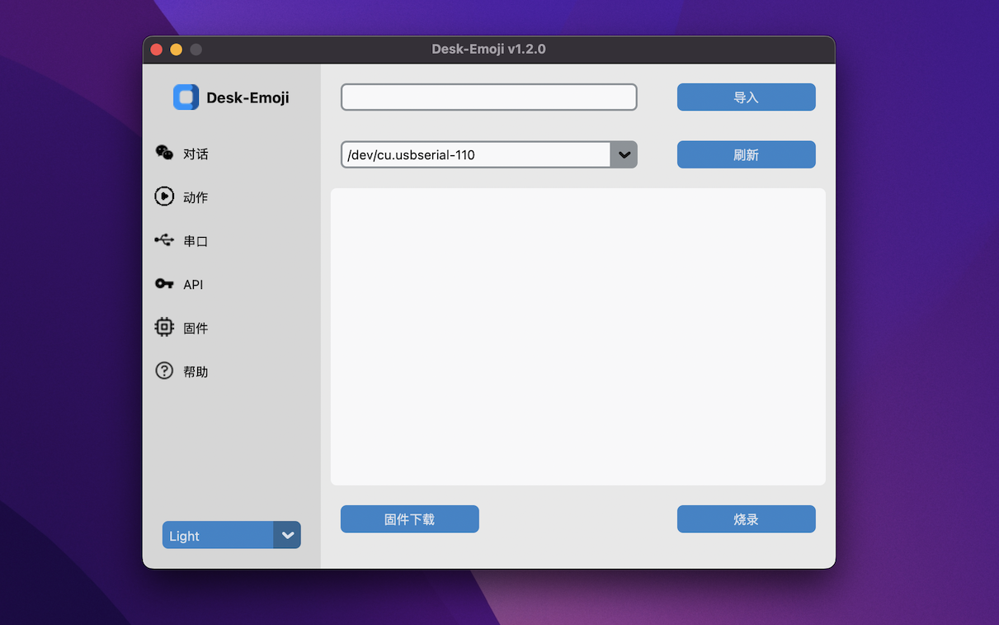

## 安装

* 从 [Python官网](https://www.python.org/) 下载 Python 并安装，版本推荐在3.9～3.11之间
* MacOS 或 Linux 环境，终端执行：`./start.sh`
* Windows 环境，直接双击运行 `start.bat`
* 第一次启动需要安装依赖，请耐心等待。

## 使用

* 首先设置串口：选择蓝牙或USB，点击“扫描”按钮，选择对应的设备，然后点击“连接”
  
* 设置 API 网址和密钥（需要支持GPT-4o-mini）
  
* 切换到“对话"页面进行对话。
  
* 切换到“动作”页面进行动作测试。
  
* 切换到“固件"进行主板固件升级
  